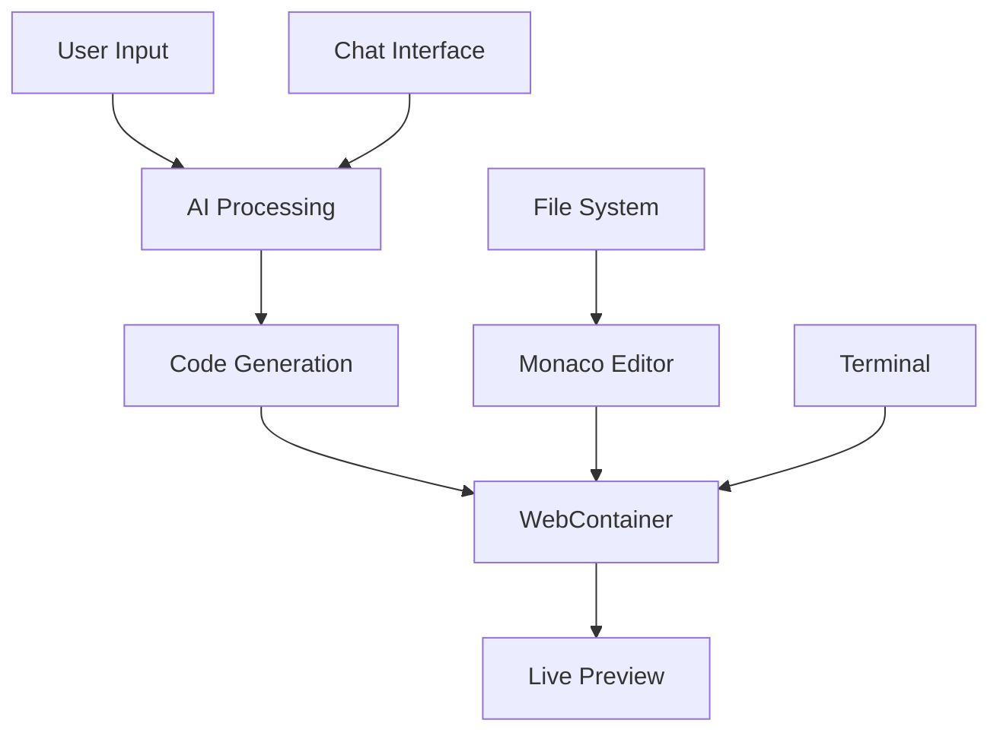

# Swift ⚡

> AI-Powered Full-Stack Development Platform

**Prompt. Run. Edit. Deploy.** Build and deploy full-stack web applications from a single natural language prompt.

[](https://opensource.org/licenses/MIT)
[](https://www.typescriptlang.org/)
[](https://reactjs.org/)
[](https://nodejs.org/)

Project link: [swift](https://swift-gg67.onrender.com)

## 🌟 Features

###  AI-Powered Development
- **Natural Language Prompts**: Describe your app in plain English
- **Intelligent Code Generation**: Get complete, production-ready applications
- **Smart Architecture Decisions**: AI chooses the right tech stack automatically

###  Complete Development Environment
- **Built-in Code Editor**: Monaco-powered editor with syntax highlighting
- **Live Preview**: See your app running in real-time as it's built
- **Integrated Terminal**: Full WebContainer-based terminal environment
- **File Management**: Complete file explorer and project structure management

###  Modern Tech Stack
- **Frontend**: React 18, TypeScript, Tailwind CSS
- **Backend**: Node.js, Express, Gemini AI API
- **Development**: Vite, WebContainer API
- **Code Editor**: Monaco Editor with advanced features

###  Key Capabilities
- **Multi-language Support**: JavaScript, TypeScript, React, Node.js, and more
- **Real-time Compilation**: Instant feedback and live updates
- **Project Export**: Download your complete project as ZIP
- **Step-by-Step Execution**: Visual progress tracking of build steps
- **Error Handling**: Robust error detection and recovery

##  Architecture



### Core Components

- **Frontend (React + TypeScript)**
  - Responsive UI with dark theme
  - Real-time chat interface
  - Integrated development environment
  - File explorer and code editor

- **Backend (Node.js + Express)**
  - Gemini AI integration for code generation
  - JSON validation and error handling
  - Template system for different project types

- **WebContainer Integration**
  - Browser-based Node.js runtime
  - Full filesystem emulation
  - Package management and build tools

##  Getting Started

### Prerequisites

- Node.js 18+ 
- npm or yarn
- Modern browser with WebContainer support

### Installation

1. **Clone the repository**
   ```bash
   git clone https://github.com/shravankumarpatell/swift.git
   cd swift
   ```

2. **Install dependencies**
   ```bash
   # Frontend dependencies
   cd frontend
   npm install
   
   # Backend dependencies
   cd ../Backend
   npm install
   ```

3. **Environment Setup**
   ```bash
   # Navigate to Backend directory
   cd Backend
   
   # Copy environment template
   cp .env.example .env
   
   # Add your Gemini API key
   GEMINI_API_KEY=your_gemini_api_key_here
   ```

4. **Start the development servers**
   ```bash
   # Start backend (from Backend directory)
   cd Backend
   npm run dev
   
   # In a new terminal, start frontend
   cd frontend
   npm run dev
   ```

5. **Access the application**
   - Frontend: http://localhost:5173
   - Backend API: http://localhost:3000

## 🔧 Configuration

### Environment Variables

| Variable | Description | Required |
|----------|-------------|----------|
| `GEMINI_API_KEY` | Google Gemini AI API key | Yes |
| `PORT` | Backend server port | No (default: 3000) |
| `NODE_ENV` | Environment mode | No (default: development) |

### WebContainer Requirements

Swift requires cross-origin isolation for WebContainer to function properly. Ensure your server serves the following headers:

```
Cross-Origin-Embedder-Policy: require-corp
Cross-Origin-Opener-Policy: same-origin
```

##  Usage

### Basic Workflow

1. **Enter Your Prompt**: Describe the application you want to build
   ```
   "Build me a React todo app with a clean design and local storage"
   ```

2. **AI Processing**: Swift analyzes your request and generates code

3. **Live Development**: Watch as your application is built step-by-step

4. **Interactive Editing**: Modify code in the built-in editor

5. **Real-time Preview**: See changes instantly in the preview pane

6. **Download & Deploy**: Export your project or deploy directly

### Example Prompts

- `"Create a landing page for a SaaS product with pricing tiers"`
- `"Build a dashboard with charts showing user analytics"`
- `"Make a blog with markdown support and dark mode"`
- `"Create an e-commerce product page with shopping cart"`

##  Development

### Project Structure

```
swift/
├── frontend/                # React frontend application
│   ├── public/             # Static assets
│   ├── src/
│   │   ├── components/     # React components
│   │   │   ├── ChatHistory.tsx
│   │   │   ├── ChatInput.tsx
│   │   │   ├── CodeEditor.tsx
│   │   │   ├── FileExplorer.tsx
│   │   │   ├── Terminal.tsx
│   │   │   └── ...
│   │   ├── pages/          # Page components
│   │   │   ├── Builder.tsx # Main IDE interface
│   │   │   └── Home.tsx    # Landing page
│   │   ├── hooks/          # Custom React hooks
│   │   │   └── useWebContainer.ts
│   │   ├── types/          # TypeScript definitions
│   │   │   └── index.ts
│   │   ├── utils/          # Utility functions
│   │   └── config.ts       # App configuration
│   ├── package.json
│   └── vite.config.ts      # Vite configuration
└── Backend/                # Node.js backend server
    ├── src/
    │   ├── defaults/       # Project templates
    │   │   ├── node.ts     # Node.js template
    │   │   └── react.ts    # React template
    │   ├── constants.ts    # App constants
    │   ├── index.ts        # Express server
    │   ├── prompts.ts      # AI prompt definitions
    │   └── stripindents.ts # String utilities
    ├── .env.example        # Environment template
    └── package.json
```

### Key Files

- `frontend/src/pages/Builder.tsx` - Main development environment
- `frontend/src/components/CodeEditor.tsx` - Monaco editor integration
- `frontend/src/components/Terminal.tsx` - WebContainer terminal
- `Backend/src/index.ts` - Express server with AI integration
- `Backend/src/prompts.ts` - System prompts for AI
- `Backend/src/defaults/` - Project templates (Node.js, React)

### Adding New Features

1. **Frontend Components**: Add to `frontend/src/components/`
2. **AI Prompts**: Modify `Backend/src/prompts.ts`
3. **Project Templates**: Add to `Backend/src/defaults/`
4. **Type Definitions**: Update `frontend/src/types/index.ts`

##  Testing

```bash
# Run frontend tests
cd frontend
npm test

# Run backend tests
cd Backend
npm test

# Run integration tests
npm run test:integration
```

##  Building for Production

```bash
# Build frontend
cd frontend
npm run build

# Build backend
cd Backend
npm run build

# Start production server
cd Backend
npm run start
```

##  Deployment

### Docker

```dockerfile
FROM node:18-alpine
WORKDIR /app
COPY package*.json ./
RUN npm ci --only=production
COPY . .
EXPOSE 3000
CMD ["npm", "start"]
```

### Environment Setup

Ensure your deployment environment supports:
- Cross-origin isolation headers
- SharedArrayBuffer availability
- WebContainer API compatibility

##  Contributing

We welcome contributions! Please follow these steps:

1. **Fork the repository**
2. **Create a feature branch**: `git checkout -b feature/amazing-feature`
3. **Make your changes**
4. **Add tests** for new functionality
5. **Commit your changes**: `git commit -m 'Add amazing feature'`
6. **Push to the branch**: `git push origin feature/amazing-feature`
7. **Open a Pull Request**

### Development Guidelines

- Follow TypeScript best practices
- Use meaningful commit messages
- Add JSDoc comments for complex functions
- Ensure all tests pass
- Update documentation as needed

##  API Documentation

### Chat Endpoint

```typescript
POST /chat
{
  "messages": [
    {
      "role": "user" | "assistant",
      "content": string
    }
  ]
}
```

### Template Endpoint

```typescript
POST /template
{
  "prompt": string
}
```

##  Troubleshooting

### Common Issues

**WebContainer not working**
- Ensure cross-origin isolation is enabled
- Check that SharedArrayBuffer is available
- Verify you're not in an iframe

**AI not responding**
- Check your Gemini API key
- Verify network connectivity
- Check API rate limits

**Preview not loading**
- Check WebContainer initialization
- Verify package.json is valid
- Check browser console for errors

##  License

This project is licensed under the MIT License - see the [LICENSE](LICENSE) file for details.

##  Acknowledgments

- **Google Gemini** for AI capabilities
- **StackBlitz** for WebContainer technology
- **Monaco Editor** for code editing experience
- **React** and **TypeScript** communities

##  Support

- **Email**: [shravankumarpatelofficial@gmail.com]

---

<div align="center">

**Built with ❤️ by the SKP**

</div>
